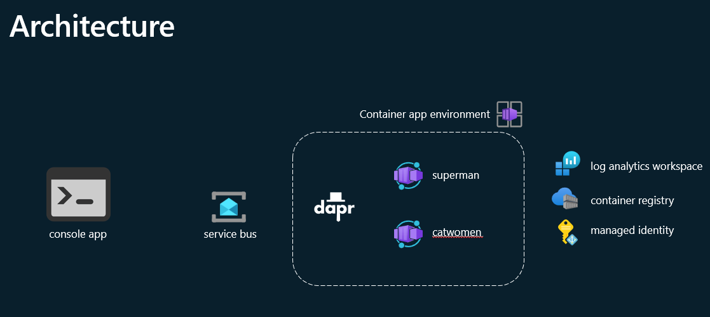
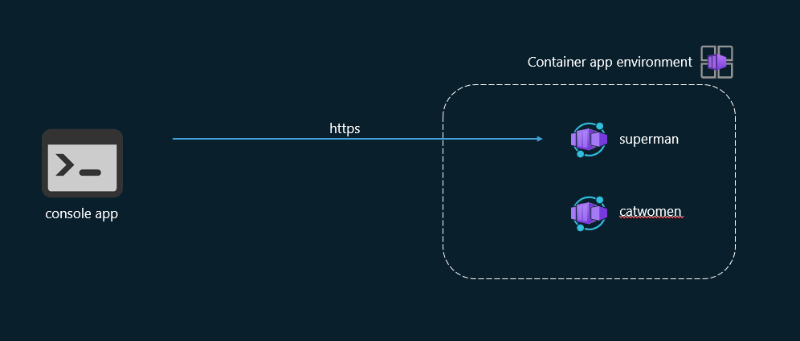
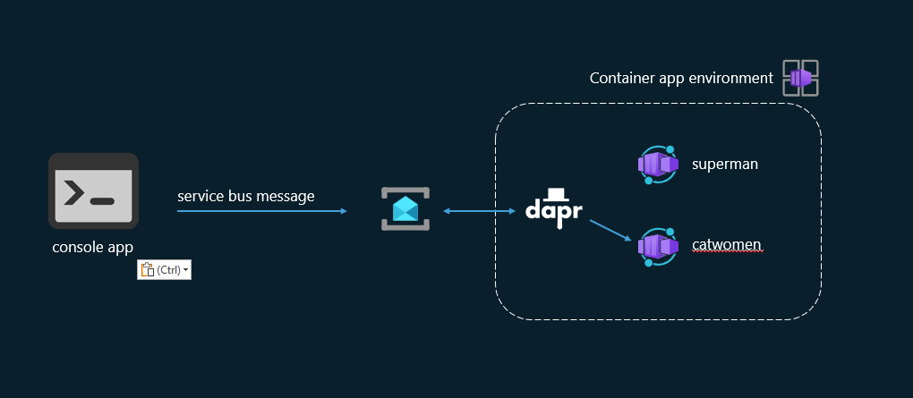

# PlatformCon - Azure Container Apps - Quick Hack 

## Introduction

This repo contains the solution shown during the ACA vs AKS PlatformCon session. 

## Prerequisites

- Azure subscription with owner rights
- VS Code or Visual Studio
- Azure CLI with Bicep
- REST Client or Postman VS code plugin or similar
- Clone this repo
- Build and run a C# console program

## Architecture

These are the Azure services that main.bicep will create. 



## Step by step guide

This section contains a step-by-step guide to setup and test the demos that was shown during the session. 

### 1. Create a resourcegroup

Choose a postfix for the resourcegroup name, five characters. e.g. "duxcf"
Replace [postfix] with your postfix in the following code, run the command.

```shell

az group create --name rg-[postfix] --location swedencentral

```

### 2. Deploy the infrastructure using Bicep

Make sure the correct subscription is used by running. 

```shell

az account show

```

Run the command.   

```shell

az deployment group create -g rg-[postfix] -n mainDeploy -f infrastructure/main.bicep

```

This creates the Azure services to be used. Wait until the Azure services are deployed, open the Azure portal in a browser and copy the name of the Azure Container Registry, replace [acr] with this name.  

### 3. Build the container image in Azure registry

Use Azure Container Registry task to build the image and push it. Run the commands. 

```shell

az acr login -n [acr]
az acr build -t platformcon/acaapi:1.0 -r [acr] AcaApi/.

```

### 4. Deploy the container apps
Run the command. 

```shell

az deployment group create -g rg-[postfix] -n mainDeploy -f infrastructure/main.bicep -p deploy=true

```

### 5. Create the declarative Dapr subscription

The declarative Dapr subscription needs to be deployed using a REST call. Use the REST client VS Code extension or similar. 

First grab a accesstoken running the following command. 

```shell
az account get-access-token --resource https://management.azure.com/ --query accessToken -o tsv
```

Replace the values in the brackets (remove the brackets) in the subscription.http (located in the infrastructure folder) file. Then click "Send request" in the subscription.http

Redeploy the containerapps to pick up the declarative subscription. 

```shell

az deployment group create -g rg-[postfix] -n mainDeploy -f infrastructure/main.bicep -p deploy=true

```


### 6. Configure the Loadconsole application 

Replace the values in brackets in LoadConsole/appsettings.json. 
Grab the unique string (5 characters) that has been created for all the azure services. e.g ns-abc12, then "abc12" is the unique string   
Grab the primary connection string for the servicebus. 

```shell
az servicebus namespace authorization-rule keys list -g rg-[postfix] --namespace-name ns-[unique string] --name RootManageSharedAccessKey --query primaryConnectionString -o tsv
```

Grab the primary url address for the container app.

```shell
az containerapp show -g rg-[postfix] --name superman --query properties.configuration.ingress.fqdn -o tsv

```

### 7. Run the LoadConsole

Build the LoadConsole application, run the command.


```shell
dotnet build .\LoadConsole\LoadConsole.csproj
```

Send requests to http endpoint. The app takes 3 arguments

Type: http or queue | http endpoint or servicebus

Requests: int | number of requests for every thread 

Threads: int | number of threads to run 

Example ".\LoadConsole\bin\Debug\net8.0\LoadConsole.exe http 10 5" runs 10 requests on 5 threads to the http endpoint 



Http
```shell
.\LoadConsole\bin\Debug\net8.0\LoadConsole.exe http 10 5
```



Servicebus
```shell
.\LoadConsole\bin\Debug\net8.0\LoadConsole.exe queue 10 5
```

Check logs inside container apps

Servicebus
```shell
az containerapp logs show --name catwomen --resource-group rg-[postfix] --type console --follow

```

Http
```shell
az containerapp logs show --name superman --resource-group rg-[postfix] --type console --follow

```